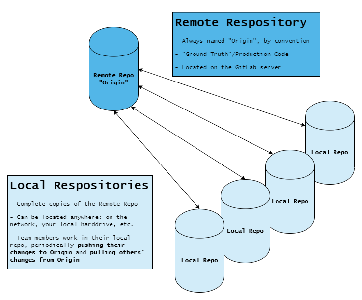
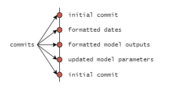
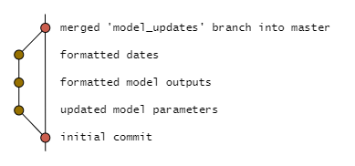
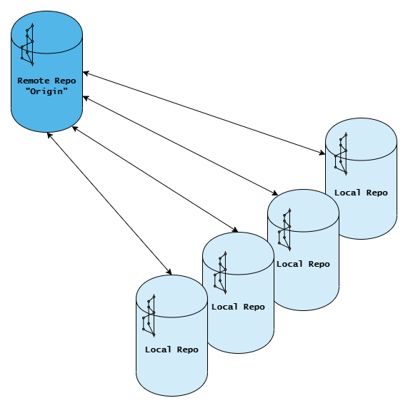

# Module 2: Git Concepts

Before diving into commands, there are two high-level concepts you should understand: **Distributed Version Control** and **Branching**.

## Distributed Version Control

`git` is a distributed version control system. This means that collaborators
work on separate, potentially unconnected systems, and periodically sync their
changes to a shared central repository of code.



## Branching

In `git`, a branch is a series of **commits**, which are like save points in
your code.



When you start a new project, `git` creates a default branch called `main`.
Most people use this `main` branch to serve as their production branch, but
you can rename it or use a different branch as your "ground truth"/production
branch if you wanted to.

Rather than developing new features on the `main` branch, it is best practice
to branch off until the feature is complete, tested, and peer-reviewed. At this
point, you can merge it into the `main` branch to deploy your new feature.



## Combining Distributed Version Control and Branching

Now, we are going to combine these two concepts to clear up a common tripping
point: conflating repositories with branches. As mentioned earlier, each
repository is a complete copy of the entire codebase, meaning it has every
branch in the entire project. Note: as teammates work in their local repo,
what is contained in the origin and everyone's local repos begin to deviate,
but with `git` we can periodically sync them back up.



When first starting to use `git`, some people have trouble keeping the concepts
of repositories and branches separate. Keep in mind that:

- If you have a local repo, then you have all of the branches that were on the
  remote repo the last time you synced-up with it, plus any branches or commits
  that you have created locally
- Until you send any local changes to the remote repo, they exist only locally
  and your teammates will not see them

This is where the concepts of **push**, **pull**, and **fetch** come in — covered next.

## Local vs. Remote: Push, Pull, and Fetch

Because every developer has their own full copy of the repo, git needs explicit commands
to sync changes between your local machine and the shared remote repo (called **origin**
by convention — it's just the name git assigns to the URL you cloned from).

Here's the mental model:

```
Your computer                     GitHub (origin)
─────────────                     ───────────────
 local repo   ── git push ──►     remote repo
 local repo   ◄── git pull ──     remote repo
 local repo   ◄── git fetch ──    remote repo  (download only, don't merge yet)
```

- **`git push`** — uploads your local commits to GitHub so teammates (and you, on another machine) can see them. Nothing you commit locally is visible to anyone until you push.
- **`git pull`** — downloads the latest commits from GitHub _and_ merges them into your current branch. This is how you get a teammate's changes into your local copy.
- **`git fetch`** — downloads the latest commits from GitHub but does _not_ merge them. Useful for checking what's changed before deciding to merge.

You'll use `push` and `pull` constantly. Think of it like saving to a shared drive:
committing is saving to your own machine, pushing is uploading to the shared drive,
and pulling is downloading the latest version from it.

---

**Previous:** [Module 1 - Setup](./01_setup.md) | **Next:** [Module 3 - Git Workflow](./03_workflow.md)
