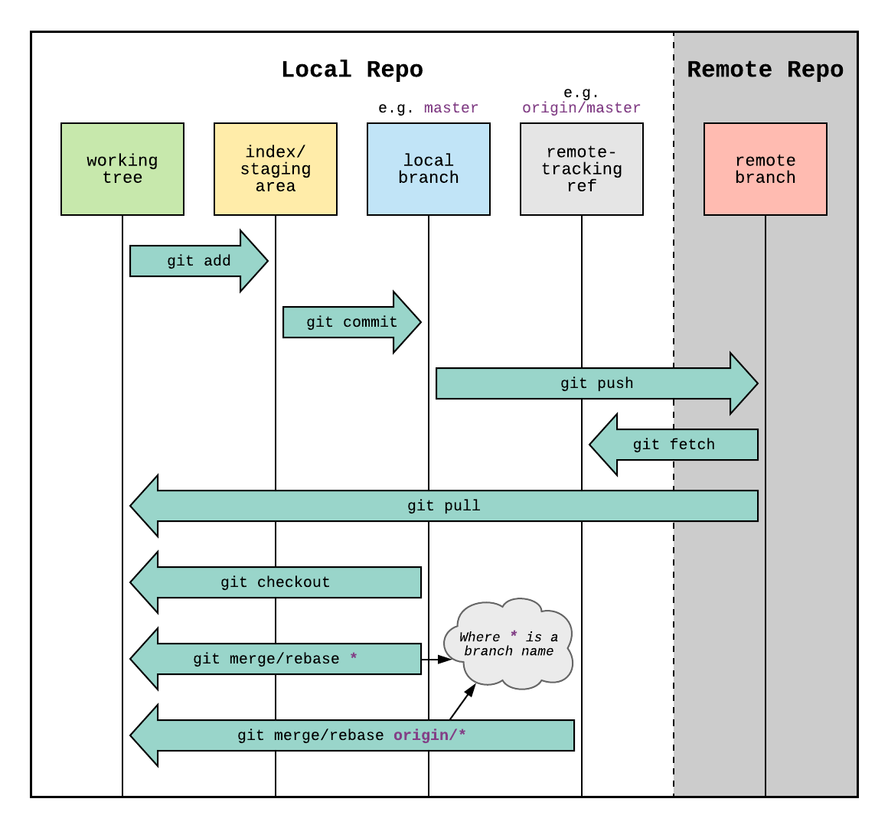

# Module 3: Git Workflow

Now you are ready to contribute to the project. As always, you should read the [docs](https://git-scm.com/docs),
but this module covers the main commands you need to know. This list is not exhaustive, nor will some commands
make sense until you have used them a few times.

## Basic Commands

- `git branch` - list the branches in your local repository, with an asterisk on the branch you have checked out
- `git branch <new_branch>` - create a new branch named `<new_branch>`
- `git checkout <branch_to_checkout>` - checks out the branch named `<branch_to_checkout>`
- `git status` - shows the working tree status, i.e. the changes you've made since your last commit — this command has no external effects and can be run "for free" at any time
- `git add <file1> <file2>` - add changed files to the "staging area" so you can commit them
  - You can use `git add -A` to add all changed files rather than typing them out individually
- `git commit -m "<commit message>"` - commit your changes to your branch with the given commit message
- `git push` - upload your local commits to GitHub so teammates can see them (see [Module 2](./02_concepts.md) for the push/pull mental model)
- `git pull origin main` - download the latest commits from the `main` branch on GitHub and merge them into your current branch

## Making a Working Branch

_Note:_ If you haven't cloned this repo yet, go back to [Module 1](./01_setup.md) and complete that step first.


Execute the `git branch` command to see your local repo's branches. The one with
an asterisk is the branch you currently have checked out. Also notice that
`Git Bash` shows you your current branch on the line above the command prompt,
if your working directory is, in fact, a `git` repo:

```
$ git branch
* main
```

_Note_: Whenever you see a `$` at the beginning of a command, the text _after_ the `$` is what you
will type into Git Bash. The text that follows that line is the output you should expect to see.

We discussed how it's best practice to do your development on a working branch,
rather than on `main`. Let's make a new branch:

```
git branch my_new_branch
```

_Note_: In practice, give your branches names descriptive of what feature is being developed or what
bug is being fixed. Most git tools can group branches if you use names like `feature/new_feature` or
`bugfix/pesky_bug`, putting them into a folder-like structure that is easier to navigate.

Now, if you run `git branch` again, you will see your new branch:

```
$ git branch
* main
  my_new_branch
```

Notice that we still have `main` checked out. Use `git checkout my_new_branch`
to check out your newly created branch.

**Shortcut:** You can create and check out a new branch in one command with the `-b` flag:

```
git checkout -b my_new_branch
```

## Adding and Committing Changes

Now that you have created and checked out a working branch, you are ready to
start writing code. This section demonstrates how to make a commit to `my_new_branch`.

### Working Tree and Staging Area

When you work on code, `git` tracks your changes (modified, added, deleted
files and directories). When you are ready to commit your changes (i.e. create
a "save point"), you have to tell `git` which changes to include in the commit.

Be very specific about what changes you commit. The last thing you want to do is accidentally
commit credentials (usernames, passwords, security keys, etc.) to a plain text file.
Those are hard to remove once committed and cause major security concerns even in private repos.

Below is a diagram of what the typical git workflow looks like.

_Git Workflow_

Credit: https://www.reddit.com/r/git/comments/99ul9f/git_workflow_diagram_showcasing_the_role_of/

On the left is the `working tree`. As you work, changes to files are stored there.
At any point, you can run `git status` to see the status of your working tree. For example,
if I add a new file to the project with `touch my_new_file.txt`, then run `git status`:

```
$ git status
On branch my_new_branch
Untracked files:
  (use "git add <file>..." to include in what will be committed)
        my_new_file.txt

nothing added to commit but untracked files present (use "git add" to track)
```

`git` recognizes the new file and hints how to track it. Let's add it:

```
$ git add my_new_file.txt

$ git status
On branch my_new_branch
Changes to be committed:
  (use "git restore --staged <file>..." to unstage)
        new file:   my_new_file.txt
```

Now `my_new_file.txt` is staged to be committed. After opening the file, adding some text
("Hello, World!"), and saving it, run `git status` again:

```
$ git status
On branch my_new_branch
Changes not staged for commit:
  (use "git add <file>..." to update what will be committed)
  (use "git restore <file>..." to discard changes in working directory)
        modified:   my_new_file.txt

no changes added to commit (use "git add" and/or "git commit -a")
```

Now `my_new_file.txt` is already tracked but `git` recognizes it has been modified.
Let's commit with `git commit`:

```
$ git commit -m 'my first commit'
[my_new_branch 14e26e3] my first commit
 1 file changed, 1 insertion(+), 1 deletion(-)
```

The `-m` flag provides a short description of the changes saved in this commit. When omitted,
you will be prompted to enter a message in your default editor.

As a best practice, commit messages should be specific and descriptive. Commit often and in
small chunks — this leaves a clearer trail for you and whoever works on the project after you.

After committing, the working tree is clean:

```
$ git status
On branch my_new_branch
nothing to commit, working tree clean
```

## A Note on `git switch`

You may see `git switch` used in online tutorials as an alternative to `git checkout` for
changing branches. It was introduced in git 2.23 as a more focused command:

```
git switch my_new_branch          # same as: git checkout my_new_branch
git switch -c my_new_branch       # same as: git checkout -b my_new_branch
```

Both work. This course uses `git checkout` because it's more widely documented and
what you'll most often see in your teammates' code and Stack Overflow answers.

## What About Git GUIs?

> **Important:** Work through this entire course using the command line first.
> Understanding what git is actually doing is essential before adding a UI on top of it.
> Trainees who skip straight to a GUI often struggle to understand error messages,
> recover from mistakes, or work on a machine where their preferred tool isn't installed.
> The command line is always available. GUIs are not.

Once you're comfortable with the commands, graphical interfaces can speed up your day-to-day
workflow — especially for viewing diffs, staging individual lines, and navigating history.
Here are the most common options:

| Tool | Description |
|---|---|
| **[GitHub Desktop](https://desktop.github.com)** | Simple, beginner-friendly GUI made by GitHub. Good for basic workflows. |
| **[VS Code Source Control](https://code.visualstudio.com/docs/sourcecontrol/overview)** | Built into VS Code. Handles staging, committing, and viewing diffs without leaving your editor. The most practical choice if you're already in VS Code all day. |
| **[GitKraken](https://www.gitkraken.com)** | Feature-rich GUI with a strong visual branch graph. Free for public repos; paid for private. |
| **[Sourcetree](https://www.sourcetreeapp.com)** | Free, full-featured GUI from Atlassian. Popular on Windows and Mac. |
| **[git built-in GUI](https://git-scm.com/docs/gitk)** | `gitk` and `git gui` ship with git itself — basic but always available. |

None of these replace knowing the commands. They are wrappers around the same operations
you've been learning. When something goes wrong — and it will — you'll be glad you understand
what's happening underneath.

---

**Previous:** [Module 2 - Git Concepts](./02_concepts.md) | **Next:** [Module 4 - Merge Conflicts](./04_merge_conflicts.md)
