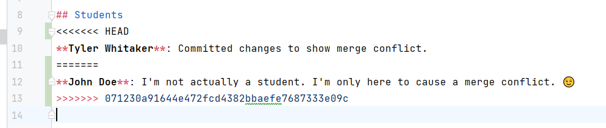

# Module 4: Merge Conflicts

At this point, let's imagine that you've been doing development on your working
branch for a while — let's say a week. If it branched off from `main` a week ago,
your teammates may have been adding features to the main branch during that week,
none of which you have in your branch. You want to periodically merge their changes
into your working branch to check for conflicts resulting in either errors or adverse
effects in the project.

## Pulling a Branch

As a reminder from [Module 2](./02_concepts.md): `git pull` downloads commits from GitHub and
merges them into your current branch. The format `git pull origin <branch>` means "pull the
named branch from origin (GitHub) into wherever I am right now."

The branch `feature/conflict-notes` has been created to simulate work done by a teammate.
If we compare this branch to `main`, you will see that it is some commits ahead of `main`.
We can `pull` that work into our branch to "resolve conflicts" between the two branches.

Conflicts occur when 2 branches have commits touching the same area of code at roughly the
same time. Git doesn't know if one is supposed to replace the other, or if both should be
included — so it prompts you to resolve the conflict manually and complete the merge.

Once we are ready to update our branch, we run:

```
$ git pull origin feature/conflict-notes
From github.com:summitllc/git_school
 * branch            feature/conflict-notes -> FETCH_HEAD
Auto-merging sandbox/ex5_team_notes.txt
CONFLICT (content): Merge conflict in sandbox/ex5_team_notes.txt
Automatic merge failed; fix conflicts and then commit the result.
```

_Note:_ You would typically pull `origin main`, however you can pull any branch (local or
remote) to bring those changes into your working branch.

## Resolving the Conflict

In the output, we see that git attempted to automatically merge the two branches, which
resulted in a conflict. We can investigate further by opening the affected file.



Git uses a specific syntax to show conflicting sections of code. In this case, two teammates
added notes to `sandbox/ex5_team_notes.txt` in the same location of the file. Git doesn't know which
change should take precedence, so it kept all the content and will not let you move on
until you resolve the conflict.

At this point you need to decide which code to keep. You can choose to keep only one branch's
changes, both, or some combination — depending on your specific requirements. After resolving
the conflict, return to the terminal, add the affected files to the staging area, then create
a commit indicating that a merge was completed.

Now that you have resolved the conflicts and pulled the branch into your code, you are ready
to push to your remote repo and submit a Pull Request.

---

**Previous:** [Module 3 - Git Workflow](./03_workflow.md) | **Next:** [Module 5 - Pull Requests](./05_pull_requests.md)
