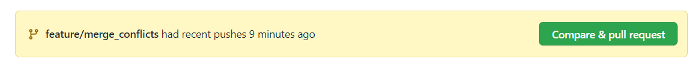
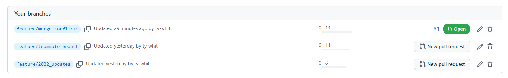
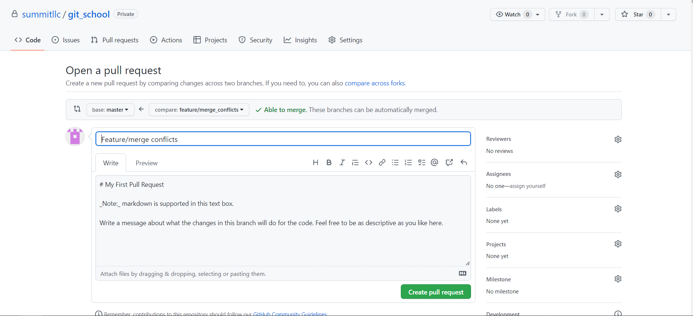
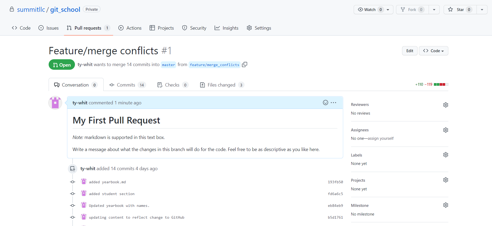
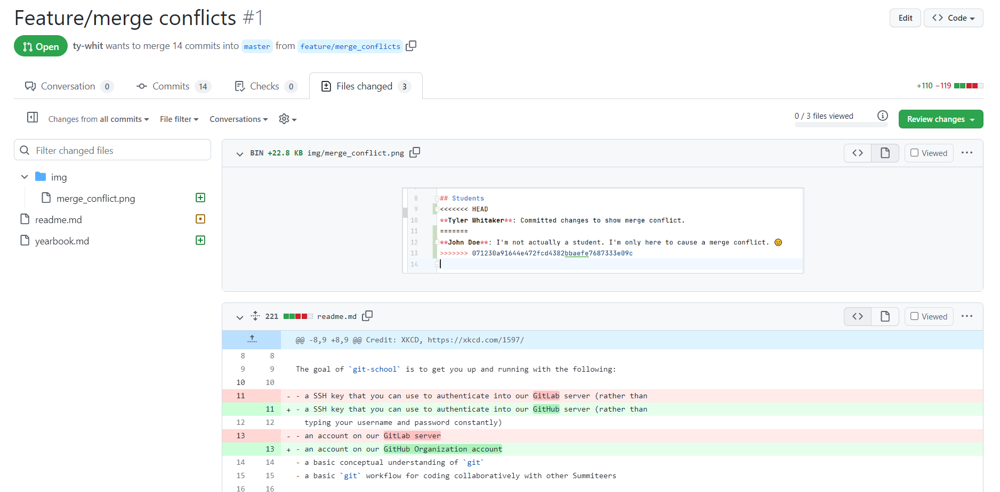
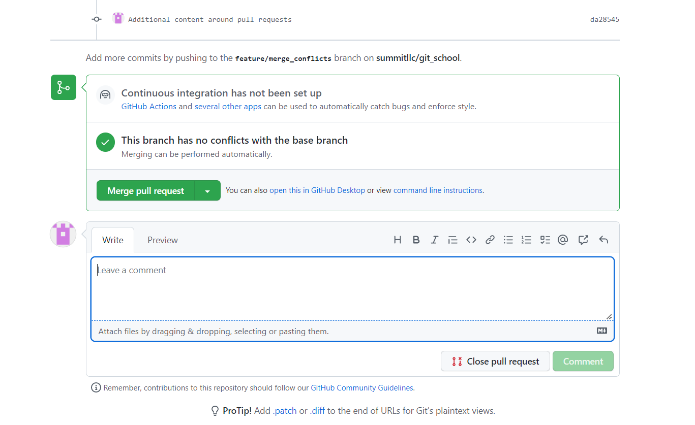
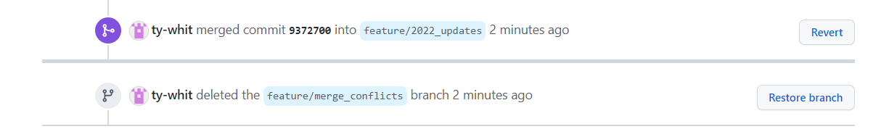

# Module 5: Pull Requests

Once you have finished working on your branch, it is time to submit a Pull Request (sometimes
also called a merge request). The first thing you must make sure is that all changes you want
merged are committed and pushed to your remote repo.

## Pushing Your Branch

Up until now, all of your commits have only existed on your local machine. `git push` uploads
them to GitHub (the remote repo) so your teammates can see your branch and you can open a
Pull Request. Until you push, nobody else can see your work.

```
$ git push
```

`git push` will by default push your current branch to a branch of the same name on GitHub.
If the branch doesn't exist on GitHub yet, git will create it automatically.

## Opening a Pull Request

After navigating to the remote repo on GitHub, you will commonly find a banner like the following:



If you see this button, click the green button to start the process.

Alternatively, you can always navigate to the branches display and select "New pull request".



This will bring you to the Pull Request creation page:



On this page, you can select the branch being merged into (typically `main`), add a title and write a
description to explain what your pull request is changing. Be as descriptive as your team and project
requires. Different projects may require a specific format for this comment — for Summit projects,
refer to your team lead to determine any requirements that may apply. You can also tag people, issues,
and other pull requests. Lastly, you may need to add a Reviewer, Projects, Labels, or Milestones,
which are all selected by interacting with the column on the right of the page.

## Reviewing a Pull Request

Once created, you will land on the Pull Request conversation page:



This page displays comments, reviews, commits, and any status changes of the pull request.
Important tabs across the top to be aware of:

- **Commits** — lists the commits on this branch that differ from the destination branch
- **Checks** — applicable if your team has set up CI/CD pipelines in GitHub Actions. This page
  tests those pipelines to see if everything will run correctly if this branch is merged in.
  This could include build scripts, deployment scripts, unit tests, or any other automation
  your team has set up.
- **Files Changed** — the most important tab for your internal work at Summit. Shows all
  changes made to all files on your branch (only including commits that _don't_ already exist
  in your destination branch).



In the Files Changed view, lines highlighted in red were removed and lines highlighted in green
were added. Git and GitHub try to pair green and red lines together to show what replaced what.

Your supervisor will likely select the "Review changes" button, which enables them to comment on
specific parts of the code and give approval for the branch to be merged. Once you get approval,
you (or your supervisor) will return to the conversation page and select "Merge pull request".



Once merged:



Your work has been successfully merged. It is best practice to delete the branch after merging.
This reduces confusion around which branches are finished, which ones are in progress, and keeps
the repo free of stale branches. If further work needs to be done on the same feature after
merging, create a new branch with a different name (e.g., `feature/branch_name_v2`).

## Updating Your Local `main` Branch

With all your work merged in GitHub, remember to bring those changes back to your local repo.
Checkout your local `main` branch and run `git pull`:

```
$ git checkout main
$ git pull
```

Now you are ready to create a new branch and work on something new!

---

**Previous:** [Module 4 - Merge Conflicts](./04_merge_conflicts.md)
