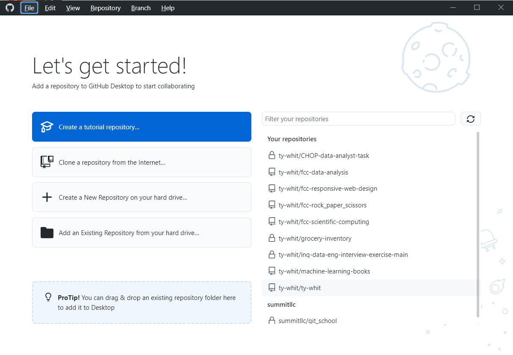
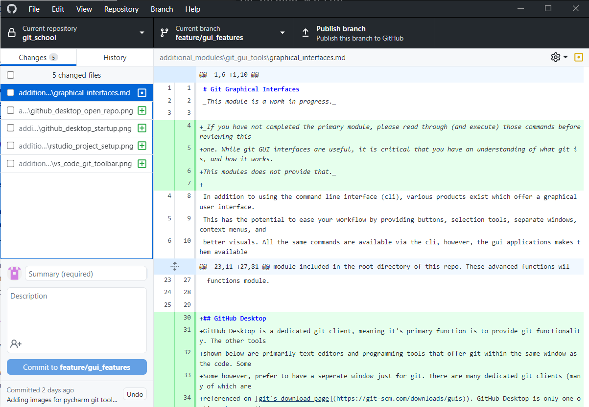
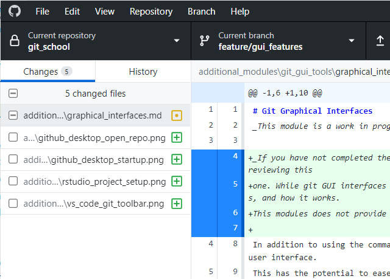
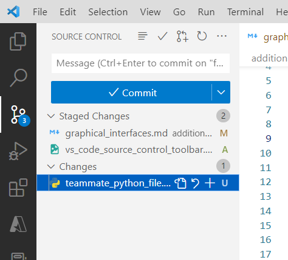
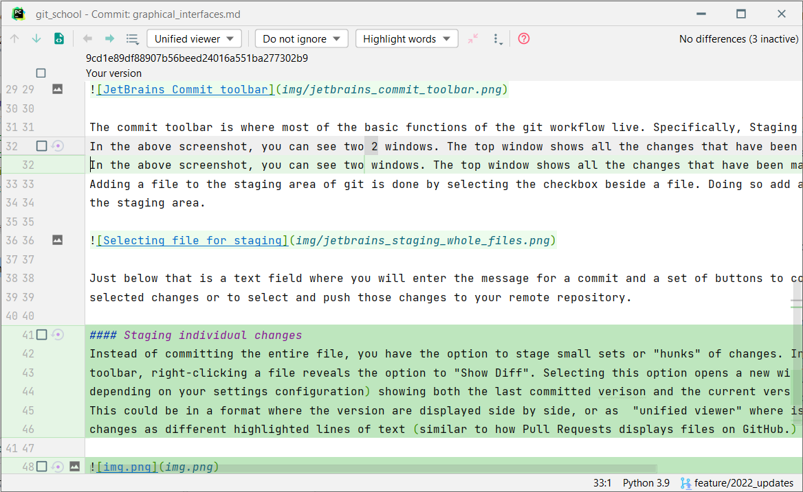
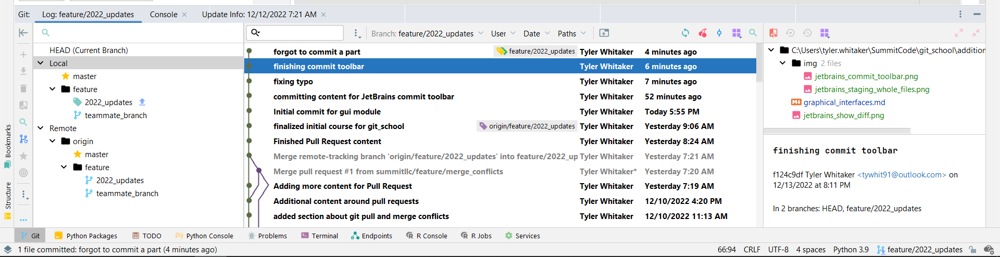
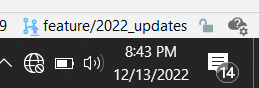

# Git Graphical Interfaces
_This module is a work in progress._

_If you have not completed the primary module, please read through (and execute) those commands before reviewing this 
one. While git GUI interfaces are useful, it is critical that you have an understanding of what git is, and how it works.
This modules does not provide that._

In addition to using the command line interface (cli), various products exist which offer a graphical user interface. 
This has the potential to ease your workflow by providing buttons, selection tools, separate windows, context menus, and 
better visuals. All the same commands are available via the cli, however, the gui applications makes them available 
for selection via the mouse instead of relying on help commands to know what is available. That being said, beware of 
the more advanced functionality of git. If there is an option that you don't recognize, don't select it until you know 
what you are doing. 

In this module, we will take a short tour of some popular tools and ones that are very relevant to Summit's workflow: 
- GitHub Desktop
- Visual Studio
- Visual Studio Code
- RStudio
- JetBrain IDEs, such as PyCharm, WebStorm, and Rider

There is no need to read this entire document. The motivation of this module is to demonstrate how some gui tools that 
you may encounter useful to accelerate your work with git. Feel free to read about only the tools that you will be using 
most frequently. Many of these tools include some advanced git functionality in addition to the basics covered in the 
module included in the root directory of this repo. These advanced functions will not be covered in this module, as they
 are out of the intended scope. Please do your own research to discover what these options do, or review the advanced 
 functions module. 

## GitHub Desktop
GitHub Desktop is a dedicated git client, meaning it's primary function is to provide git functionality. The other tools 
shown below are primarily text editors and programming tools that offer git within the same window as the code. Some 
Some however, prefer to have a seperate window just for git. There are many dedicated git clients (many of which are 
referenced on [git's download page](https://git-scm.com/downloads/guis)). GitHub Desktop is only one option, however the 
functionality and workflow will be similar across most options should you chose to try something else. 

When first booting GitHub Desktop, you will be prompted to sign in to your GitHub account. Doing so will give the 
application access to the repos you have access to. After doing so, you will see the following page:

From here, you will need to link a repo to the application. If you are starting on a brand new application Then you can
select "Create a New Repository on your hard drive", at which point it will ask where you want to create the repo. This 
new dialog box mimics many parts of what you will see on creating a new repo in GitHub, with the difference of a file 
path being requested. Most likely, you will be cloning a repository from the internet. Pressing the respective button
opens a dialog box, prompting you to either 1. select a repo from the list of repos that you have access to or 2. give 
a url to a repo (for example, if you were cloning from some other service, such as BitBicket, GitLab, or Azure DevOps).
However, if you are coming here from the primary module (readme.md in the root of this repo) you likely already have 
this repo cloned to your machine. In that case, select the last button to "Add an Existing Repository from your hard 
drive." This will prompt you for the path to that repo. Inserting the path to your local repo opens the following page. 

The column on the left shows the files that have been changed. Selecing a file will display the changes in the same way
you see the changes during a pull request. To stage entire files, select the checkbox beside the file name. Commit those 
changes by typing a message in the summary box below the file list and pressing the button labeled "Commit to 
<branch_name>". 

However, instead of committing the entire file, it is also possible stage and commit individual lines or sections of 
your code. For example, using the picture above, I can choose to select only lines 4 - 7 by clicking on the line number 
that I want and dragging the mouse through all the lines I want to commit right now.

Now, those lines have turned blue, indicating that those lines are ready to be staged. The rest of the lines only show 
changes made to the files (indicated by the typical green and red). Once committed, those lines lose their highlighting,
indicating that git no longer considers them as changes to the file, because they have been committed. This selection 
lines and chunks instead of committing the entire file is considered best practice as it helps avoid accidentially 
committing things that should not be committed in the repo, such as username and password credentials, or application or
api secret keys. 
## Visual Studio Code
The fan favorite extensible text editor includes a very minimal git widget. Selecting the branches icon will open the 
"Source Control" toolbar. 

The main view of the toolbar shows all files that git registers as changed in some form or another. Each file is 
organized into either "Staged Changes" or "Changes". Files in the "Changes" section are _not_ staged to be committed.
Add a file to the "Staged Changes" list by clicking the plus icon on a file. Remove a file from "Staged Changes" by 
selecting the minus icon on a file. It is possible for a file to appear in both lists, if some changes have been staged 
and others not. Each file displays a letter at the end of the row. The letters represent the following 
- **U**: Untracked file.
- **A**: Added (new) file. 
- **M**: Modified file.
- **D**: Deleted file. 
- **R**: Renamed file (also applied to files that have been moved to a new location in the directory)

When hovering over a file, you will see 3 icons to open the file, discard all changes to that file, and to add/remove 
to/from the staging area. Instead of staging the entire file, ranges can be staged by selecting the lines in the text 
editor.  

Once the changes have been selected, type a message and press the commit button to save the changes. More git commands 
are available in the three dots menu above the message text field, such as creating branches, pulling and pushing 
changes. 

_Note:_ Further functionality can be added through the use of extensions. For example, GitLens adds menus at the bottom 
of the above mentioned Source Control toolbar for viewing branches, commit history on an open file, details on a 
specific commit, and much more. I will not be covering those however, they do not come with the software by default.  

## RStudio
R Studio provides git functionality though it does not take a forward presence like some other text editors and IDEs. In 
order to use version control inside RStudio, you must first open a project either by opening an existing project, 
creating a new project, or cloning a repository. 
- When starting a new project, you will be prompted with the option to create a git repository
- Opening a project in an existing folder, R studio will recognize the git repository (if present)
- When opening a project without a preexisting git repository, you can generate that by navigating to the menu bar and
selecting `Tools > Version Control > Project Setup`. This opens a "Project Options" menu, focused on version control.
At the top is a dropdown menu, allowing you to select which version control system you would like to use. In our case, 
select git and press "OK", confirm the creation of a new git repository, and allow RStudio to restart. Once complete,
git commands are now ready to be used. 
- Cloning a repo will prompt you to include the URL of the remote repository. 

[wip]

## JetBrains IDEs
Jetbrains products use menus that are pined to docks on the sides and bottom of the windows. These can be rearranged as 
needed to fit your preference. They may also be hidden if you have yet to use them on a given project, such as if a 
folder is not a git repository. Screenshots in this module will come from PyCharm, though other products by JetBrains 
(such as WebStorm and Rider) will feature similar features and UI elements.  

The primary toolbars that manage git and version control in PyCharm are "Commit" and "Git". In my instance of PyCharm, 
these are located on the left and bottom sides respectively. 

### Commit Toolbar

The commit toolbar is where most of the basic functions of the git workflow live. Specifically, Staging and committing. 
In the above screenshot, you can see two windows. The top window shows all the changes that have been made in the repo. 
Adding a file to the staging area of git is done by selecting the checkbox beside a file. Doing so add all changes to 
the staging area.

Just below that is a text field where you will enter the message for a commit and a set of buttons to commit the 
selected changes or to select and push those changes to your remote repository. 

#### Staging individual changes
Instead of committing the entire file, you have the option to stage small sets or "ranges" of changes. In the "Changes"
toolbar, right-clicking a file reveals the option to "Show Diff". Selecting this option opens a new window (or tab, 
depending on your settings configuration) showing both the last committed version and the current version of the file.
This could be in a format where the version are displayed side by side, or as  "unified viewer" where is shows the 
changes as different highlighted lines of text (similar to how Pull Requests displays files on GitHub.)

The color highlighting the text indicates whether the lines have had additions or subtractions, though the exact color 
will change based on the theme being used. Lines with changes will show one line with the text removed, and a line below 
it with the text added. Inside this window, you have the ability to select specific ranges that you would like to 
include for a given change. This becomes helpful if you are working on several parts of a single file. Some parts may be 
ready to be committed and pushed, but not others. Another use is if your code includes credentials or secret keys that 
should not be committed to the remote repo. Allowing this flexibility in what changes end up being staged and committed 
also encourages small commits that save the history of a series of small changes in a long day's work on a file. 

_Minor Note:_ Indications of these differences can also be sean in the main text editor. On the side left side with line 
numbers, a colored rectangle will indicate the range where changes have been made. A triangle in between two lines 
indicates a location where text was removed. Left-clicking the rectangle will show changes, if any have been made. 

### Git Toolbar

The "Commit" toolbar allows you to focus on the individual changes of the code as they are happening, while the "Git" 
toolbar provides the tools to view and manage the repository as a whole. 

#### Branch management
The far left column contains tools relevant for branch management. Branches are organized into a tree structure. 
Branches under "Local" are branches that exist on your computer (or whatever development device is running the IDE), 
while "Remote" indicates which branches are in your remote Repository (such as GitHub). Further organization will come 
from the branch's name. If a branch has a folder-like prefix, then the JetBrains IDEs will organize those branches into 
collapsable folders. In this above screenshot, two branches have the prefix `folder/` before the unique branch name.

Any branch can be checked out by left-clicking the branch, and selecting the option "Checkout". The branch with (what I 
think looks like) a price tag icon idicates the branch that is currently checked out. Alternatively, the current 
branch's name is displayed in the bottom right corner of the window.

New branches can be created from any branch by selecting the branch then pressing the plus icon, or by selecting the 
option from the context menu after right-clicking a branch. Doing so opens a dialog box prompting for the name of the 
new branch and an option to check out that branch after creation. Up and down arrows will indicate whether a branch has 
commits to be pushed or pulled relative to remote.  

#### Commit History
The middle section displays a timeline of commits in the order that they happened for the entire repository. Across the 
top are a set of filters that allow you to narrow down the commits if you are looking for a specific change or set of 
changes. It also has the ability to display the branches that are relevant as seperate lines to be followed. Each commit
is represented as a dot on one of those branch lines, and places where the lines come together represent merges and when
they happened.

Selecting a specific commit populates the columns on the far right. The top window indicates which files were affected 
by that commit, and the bottom window shows some more information about that commit, such as the author, their email 
address and the timestamp of that commit. The changes made at that commit can be viewed by double-clicking a file, while 
right-clicking provides a few more options for viewing. 

### Git Dropdown
The last part I wanted to point out was the Git dropdown in the Menu Bar. This contains many options, which you 
should recognize as options from the cli tool, words such as add, commit, push, pull, fetch, and branches. Many of these
options lead to dialog boxes and toolbars that we have already referenced, so I will not go into detail about what these 
mean.
