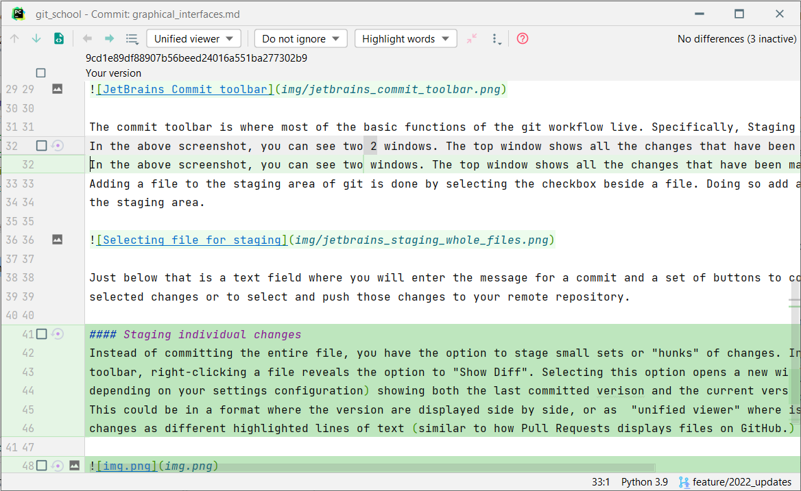

# Git Graphical Interfaces
_This module is a work in progress._

In addition to using the command line interface (cli), various products exist which offer a graphical user interface. 
This has the potential to ease your workflow by providing buttons, selection tools, separate windows, context menus, and 
better visuals. All the same commands are available via the cli, however, the gui applications makes them available 
for selection via the mouse instead of relying on help commands to know what is available. That being said, beware of 
the more advanced functionality of git. If there is an option that you don't recognize, don't select it until you know 
what you are doing. 

In this module, we will take a short tour of some popular tools and ones that are very relevant to Summit's workflow: 
- GitHub Desktop
- Visual Studio
- Visual Studio Code
- RStudio
- JetBrain IDEs, such as PyCharm, WebStorm, and Rider

Many of these tools include some advanced git functionality in addition to the basics covered in the module included 
in the root directory of this repo. These advanced functions will not be covered in this module, as they are out of the 
intended scope. Please do your own research to discover what these options do, or review the advanced functions module. 

## JetBrains IDEs
Jetbrains products use menus that are pined to docks on the sides and bottom of the windows. These can be rearranged as needed to 
fit your preference. They may also be hidden if you have yet to use them on a given project, such as if a folder is not 
a git repository. Screenshots in this module will come from PyCharm, though other products by JetBrains (such as 
WebStorm and Rider) will feature similar features and UI elements.  

The primary toolbars that manage git and version control in PyCharm are "Commit" and "Git". In my instance of PyCharm, 
these are located on the left and bottom sides respectively. 

### Commit Toolbar

The commit toolbar is where most of the basic functions of the git workflow live. Specifically, Staging and committing. 
In the above screenshot, you can see two windows. The top window shows all the changes that have been made in the repo. 
Adding a file to the staging area of git is done by selecting the checkbox beside a file. Doing so add all changes to 
the staging area.

Just below that is a text field where you will enter the message for a commit and a set of buttons to commit the 
selected changes or to select and push those changes to your remote repository. 

#### Staging individual changes
Instead of committing the entire file, you have the option to stage small sets or "ranges" of changes. In the "Changes"
toolbar, right-clicking a file reveals the option to "Show Diff". Selecting this option opens a new window (or tab, 
depending on your settings configuration) showing both the last committed version and the current version of the file.
This could be in a format where the version are displayed side by side, or as  "unified viewer" where is shows the 
changes as different highlighted lines of text (similar to how Pull Requests displays files on GitHub.)

The color highlighting the text indicates whether the lines have had additions or subtractions, though the exact color 
will change based on the theme being used. Lines with changes will show one line with the text removed, and a line below 
it with the text added. Inside this window, you have the ability to select specific ranges that you would like to 
include for a given change. This becomes helpful if you are working on several parts of a single file. Some parts may be 
ready to be committed and pushed, but not others. Another use is if your code includes credentials or secret keys that 
should not be committed to the remote repo. Allowing this flexibility in what changes end up being staged and committed 
also encourages small commits that save the history of a series of small changes in a long day's work on a file. 

_Minor Note:_ Indications of these differences can also be sean in the main text editor. On the side left side with line 
numbers, a colored rectangle will indicate the range where changes have been made. A triangle in between two lines 
indicates a location where text was removed. Left-clicking the rectangle will show changes, if any have been made. 

  
