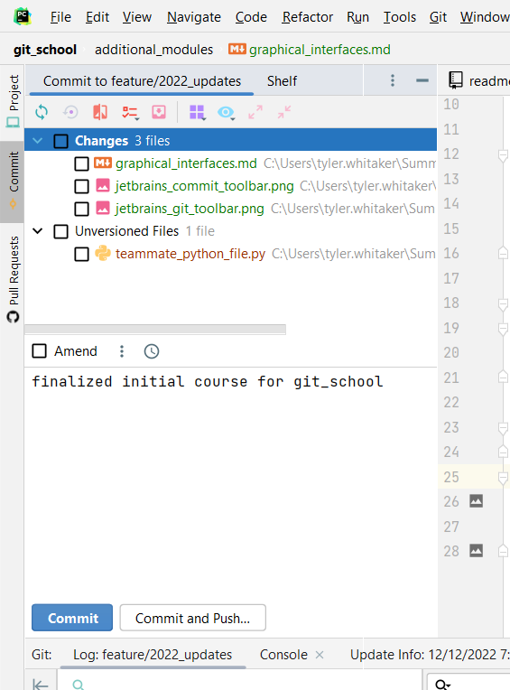
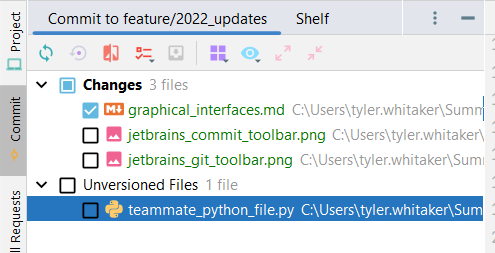

# Git Graphical Interfaces
_This module is a work in progress._

In addition to using the command line interface (cli), various products exist which offer a graphical user interface. 
This has the potential to ease your workflow by providing buttons, selection tools, separate windows, context menus, and 
better visuals. All the same commands are available via the cli, however, the gui applications makes them available 
for selection via the mouse instead of relying on help commands to know what is available. That being said, beware of 
the more advanced functionality of git. If there is an option that you don't recognize, don't select it until you know 
what you are doing. 

In this module, we will take a short tour of some popular tools and ones that are very relevant to Summit's workflow: 
- GitHub Desktop
- Visual Studio
- Visual Studio Code
- RStudio
- PyCharm (and other JetBrain IDEs)

## JetBrains IDEs
Jetbrains products use menus that are pined to docks on the sides and bottom of the windows. These can be rearranged as needed to 
fit your preference. They may also be hidden if you have yet to use them on a given project, such as if a folder is not 
a git repository. 

The primary toolbars that manage git and version control in PyCharm are "Commit" and "Git". In my instance of PyCharm, 
these are located on the left and bottom sides respectively. 

### Commit Toolbar

The commit toolbar is where most of the basic functions of the git workflow live. Specifically, Staging and committing. 
In the above screenshot, you can see two windows. The top window shows all the changes that have been made in the repo. 
Adding a file to the staging area of git is done by selecting the checkbox beside a file. Doing so add all changes to 
the staging area.

Just below that is a text field where you will enter the message for a commit and a set of buttons to commit the 
selected changes or to select and push those changes to your remote repository. 

