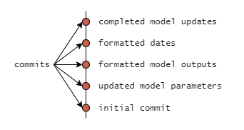
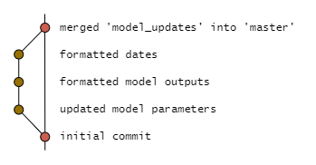
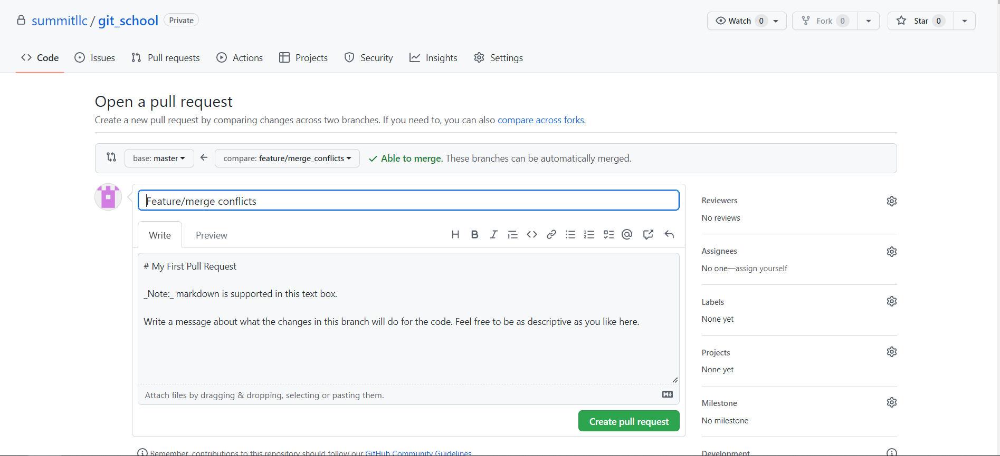

# Welcome to `git-school`!


Credit: XKCD, https://xkcd.com/1597/

## Goal

The goal of `git-school` is to get you up and running with the following:

- a SSH key that you can use to authenticate into our GitHub server (rather than
  typing your username and password constantly)
- an account on our GitHub Organization account
- a basic conceptual understanding of `git`
- a basic `git` workflow for coding collaboratively with other Summiteers

## Install `git`

To do any of this cool stuff, you need to install `git`:

- [ ] Download `git` here: https://git-scm.com/downloads
- [ ] You can follow all of the defaults during installation

Check that you successfully installed `git` by:

- [ ] Opening the `Git Bash` application
- [ ] In the `Git Bash` terminal that opens, issue this command: `git --version`
  - See [linux_command_line.md](./linux_command_line.md) for a short tutorial on using `Git Bash`
- [ ] If you do not have `Git Bash` installed, or if you get an error from
      `git --version`, you have a problem.

_Minor Note:_ Any of the git commands below will work in any command line shell where git is available. This includes command prompt (cmd) PowerShell, or Bash on a linux machine. For this tutorial, we will assume you are using Git Bash. 

## Set up Secure Shell (SSH) Authentication

Each time you request resources from Summit's GitHub Organization, you have to authenticate
yourself, proving that you have the permissions required to access that
resource. Most people do this via SSH rather than typing a username and
password in repeatedly:

### Generate SSH Key

- [ ] Generate an SSH keypair by executing the following command in `Git Bash`:
  - `ssh-keygen -t rsa -b 4096 -C "<your_email@example.com>"`
- [ ] Accept all of the defaults (press enter until you see a "randomart image"
      representing your new SSH keypair)
- [ ] Check for your new keypair in the following directory:
  - `/c/Users/<first.last>/.ssh/`
- [ ] You should see two new files:
  - `id_rsa` is your new private key - DO NOT share this with anyone
  - `id_rsa.pub` is your new public key - you will place this in your GitHub
   account, to authenticate against (with your private key, hence "keypair") 
   - note: Windows attempts to associate the `.pub` extension with Microsoft 
   Publisher. Ignore this.

### Associate Public Key with GitLab Account

- [ ] Log into your GitHub account that is associated with Summit's Git Organization.
  - [ ] If you don't have an account on GitHub, first create an account. 
  - [ ] After the account has been created, reach out to the IT Department to have them invite you to Summit's Organization. 
    - GitHub recommends having one account to manage both your personal and professional projects. There are easy methods of removing yourself from your organization after you leave Summit. 
  - [ ] Enable 2FA after joining Summit's organization. 
- [ ] Click on your avatar &rarr; `Settings` &rarr; `SSH and GPG keys`
- [ ] Back in File Explorer, open your public key in a text editor
  - [ ] Right-click on `id_rsa.pub` &rarr; 'Open With' &rarr; 'Notepad',
        for example
- [ ] In GitHub, click `New SSH key`.
- [ ] Paste the contents of `id_rsa.pub` into the text box under "Key". 
- [ ] Add a title to this key.
  - I like to give the title something descriptive like `YYYYMMDD_Summit_laptop`
- [ ] Click "Add SSH key"
  - Note for people who use multiple accounts: The same SSH Key cannot be used by multiple accounts, i.e. you cannot use a key on your personal account _and_ your work account. It is possible to use multiple keys on a single computer, but I will let those who feel confident configure that for themselves. This approach is not recommended. 

### Clone a Project (this one!) to Test Everything So Far

- [ ] Go to the GitHub page for this project:
      https://github.com/summitllc/git_school.
- [ ] Copy the SSH URL for the project. View the url by by selecting the green `<> Code` Button above the file explorer box, the selecting the SSH tab. The url should take the form `git@github.com:<owner of repo>/<name of repo>.git`
- [ ] In `Git Bash`, navigate to the directory where you want to create your
      local copy of this project (I recommend your Documents folder,
      `C:/Users/<first.last>/Documents`)
  - [ ] `cd ~/Documents`
- [ ] Clone the project with
      `git clone <url you copied in previous step>`

  - If you get the message below, answer `yes` to continue:
  ```
    Cloning into 'test_folder'...
    The authenticity of host 'github.com (20.201.28.151)' can't be established.
    ED25519 key fingerprint is SHA256:+DiY3wvvV6TuJJhbpZisF/zLDA0zPMSvHdkr4UvCOqU.
    This key is not known by any other names
    Are you sure you want to continue connecting (yes/no/[fingerprint])?
    ```

You should have a copy of the project files in
`C:/Users/<first.last>/Documents/git-school`.

## Git Concepts

There are two high-level concepts you should understand before starting to use
`git`: **Distributed Version Control** and **Branching**.

### Distributed Version Control

`git` is a distributed version control system. This means that collaborators
work on separate, potentially unconnected systems, and periodically sync their
changes to a shared central repository of code.


### Branching

In `git`, a branch is a series of **commits**, which are like save points in
your code.



When you start a new project, `git` creates a default branch called `master`.
Most people use this `master` branch to serve as their production branch, but
you can rename it or use a different branch as your "ground truth"/production
branch if you wanted to.

Rather than developing new features on the `master` branch, it is best practice
to branch off until the feature is complete, tested, and peer-reviewed. At this
point, you can merge it into the `master` branch to deploy your new feature.



### Combining Distributed Version Control and Branching

Now, we are going to combine these two concepts to clear up a common tripping
point: conflating repositories with branches. As mentioned earlier, each
repository is a complete copy of the entire codebase, meaning it has every
branch in the entire project. Note: as teammates work in their local repo,
what is contained in the origin and everyone's local repos begin to deviate,
but with `git` we can periodically sync them back up.


When first starting to use `git`, some people have trouble keeping the concepts
of repositories and branches separate. Keep in mind that:

- If you have a local repo, then you have all of the branches that were on the
  remote repo the last time you synced-up with it (`git fetch`), plus any
  branches or commits that you have created locally
- Until you send any local changes to the remote repo (`git push`), they exist
  only locally and your teammates will not see them when they sync to the
  remote (`git fetch`)

## Git Workflow

Now you are ready to contribute to the project, but you need to understand the
`git` workflow. As always, you should read the [docs](https://git-scm.com/docs),
but I will explain the main commands you need to be familiar with below. This
list is not exhaustive, nor will some of the commands make sense until you have
used them a few times:

### Basic Commands

- `git branch` - list the branches in your local repository, with an asterisk
  on the branch that you have checked out
- `git branch <new_branch>` - create a new branch, named `<new_branch>`
- `git checkout <branch_to_checkout>` - checks out the branch named
  `<branch_to_checkout>`
- `git status` - shows the working tree status, i.e. the changes you've made
  since your last commit - this command has no external effects and can be run
  "for free" at any time
- `git add <file1> <file2>` - add changed files `file1` and `file2` to the
  "staging area" so you can commit them
  - You can use `git add -A` to add all changed files rather than typing them
    out individually
- `git commit -m "<commit message>"` - commit your changes to your branch with
  the commit message "`<commit message>`"
- `git pull origin master` - fetch the current status of the master branch on
  the remote repository, then merge it into my current branch - In effect, this
  updates the branch you are working on with any changes that others have made
  to the master branch on the remote repository

### Cloning a Repo

For now, we are going to assume you want to work on an existing project. To do
this, you are going to use the `git clone` command, which is something you should
have done above to test that your SSH key is working. `git clone` will create
a new local repository (in the directory where you execute the command)
associated with a remote repository.

- [ ] If you haven't already done so, clone this repository with the following
      commands in your `Git Bash` terminal:

```
cd ~/Documents
git clone git@github.com:summitllc/git_school.git
```

_Note_: In this example, the first line changes my working directory to my
Documents, which is where I am choosing to create my local repository.

After this command runs, check for a new directory named `git-school` in your
working directory. Navigate to this new directory in File Explorer. If you
have enabled viewing of hidden items, you will notice a `.git` directory
in this directory. This `.git` directory is what makes its parent directory a
`git` repository. The `.git` directory is where all the `git` magic occurs. Mess
around inside there at your own peril!

### Making a Working Branch

Execute the `git branch` command to see your local repo's branches. The one with
an asterisk is the branch you currently have checked out. Also notice that
`Git Bash` shows you your current branch on the line above the command prompt,
if your working directory is, in fact, a `git` repo:

```
$ git branch
* master
```
_Note_: Whenever you see a `$` at the beginning of a command, such as above with 
`$ git branch`, the text _after_ the `$` is what you will type into Git Bash.
The text that follows that line is the output you should expect to see. 

We discussed how it's best practice to do your development on a working branch,
rather than on master. So, let's make a new branch by passing an additional
argument, the name of our new branch, to `git branch <new_branch_name>`:

```
git branch my_new_branch
```

_Note_: in practice, you should give your branches names descriptive of what
feature is being developed, what bug is being fixed, etc., rather than something
like "tom_branch". Additionally, most git tools can group branches together if 
you use names like `feature/new_feature` or `bugfix/pesky_bug`. Using this naming 
scheme can put them into a folder like structure and thus, easier to find in tools 
that support this feature (or at least, they will be alphabetized by the branch 
type). It also can make it easier to determine what a specific branch is supposed to be.

Now, if you run `git branch` again, you will see your new branch:

```
$ git branch
* master
  my_new_branch
```

Notice that we still have `master` checked out. Use `git checkout my_new_branch`
to check out your newly created branch.

That's it for creating a new branch, but I will point out one nice shortcut to
impress people at parties. You can accomplish both of these steps (creating and
checking out a new branch) in one simple command. It uses the `-b` option or
"flag" available in the `git checkout` command:

```
git checkout -b my_new_branch
```

### Adding and Committing Changes to your Working Branch

Now that you have created and checked out a working branch, you are ready to
get writing code. This section demonstrates how to make a commit to the
`my_new_branch` branch. Follow along with whatever branch you created.

#### Working Tree and Staging Area

This is where we need to introduce more `git` concepts: the **Working Tree**
and the **Staging Area**:

When you work on code, `git` tracks your changes (modified, added, deleted
files and directories). When you are ready to commit your changes (i.e. create
a "save point" in the project's history), you have to tell `git` which changes
to include in the commit. Be very specific about what changes you commit. The 
last thing you want to do is accidentally commit credentials (username, password,
security keys, etc.) to a plain text file. Those are hard to remove once committed
and cause major security concerns even when committed to a private repo.

Below is a diagram of what the typical git workflow looks like. 

_Git Workflow_

Credit: https://www.reddit.com/r/git/comments/99ul9f/git_workflow_diagram_showcasing_the_role_of/

On the left is the `working tree`. As you work, changes to files are stored in your
`working tree`. At any point in time, you can run the command
`git status` to see the status of your working tree. For example, if I add a
new file to the project (either through Windows File Explorer or with the shell
command `touch my_new_file.txt`), then I run `git status`, I get the following
output:

```
$ git status
On branch my_new_branch
Untracked files:
  (use "git add <file>..." to include in what will be committed)
        my_new_file.txt

nothing added to commit but untracked files present (use "git add" to track)
```

This is telling me that `git` recognizes a new file (one that it is not already
tracking). `git` also gives me a hint on how to add this file to be tracked.
It says to 'use "git add <file>..." to include in what wil be committed'. Let's
give that a try, then check out `git status` again:

```
$ git add my_new_file.txt

$ git status
On branch my_new_branch
Changes to be committed:
  (use "git restore --staged <file>..." to unstage)
        new file:   my_new_file.txt
```

Now `git` is telling me that `my_new_file.txt` is staged to be committed. The
Git Workflow figure above gives a visual reference of how I just used `git add`
to move changes from the `working tree` to the `staging area`. Now we can modify
`my_new_file.txt` and see what happens when you change a file `git` is already
tracking. After opening the file, adding some text to it ("Hello, World!"), and
saving it, I run `git status`:

```
$ git status
On branch my_new_branch
Changes not staged for commit:
  (use "git add <file>..." to update what will be committed)
  (use "git restore <file>..." to discard changes in working directory)
        modified:   my_new_file.txt

no changes added to commit (use "git add" and/or "git commit -a")
```

This output is very similar to the previous `git status`, except now
`my_new_file.txt` is already being tracked but `git` recognized that it has been
modified.

In the Git Workflow figure, we still have not moved past the second column
(`staging area`). Let's do that now by using `git commit` to create a "save
point" in the history of this working branch, `my_new_branch`. I will follow
that up with a `git status` to demonstrate that my working tree will be clean
following a commit (i.e. I won't have any changes since my last commit
immediately after committing).

```
$ git commit -m 'my first commit'
[my_new_branch 14e26e3] my first commit
 1 file changed, 1 insertion(+), 1 deletion(-)
```

The flag `-m` followed by a string of text provides a short message or description 
about the changes being saved in this commit. When omitted, you will be prompted to 
enter a message in whatever editor was selected as the default when installing git.

As a best practice, commit messages should be specific and descriptive the changes made. 
To assist in this, you should save commits often and in small chunks. Following these
practices will leave a clearer trail of breadcrumbs for you and whoever come to work 
on the project after you to follow thought processes, methods that were attempted but 
were ultimately scrapped.

After saving the commit, our working tree is now clean. We can see such by executing the following.
```
$ git status
On branch my_new_branch
nothing to commit, working tree clean
```

### Updating with Git Pull and Resolving Merge Conflicts

At this point, let's imagine that you've been doing development on your working
branch for a while now. For demonstration's sake, let's say a week. If it
branched off from `master` a week ago, your teammates may have been adding
features to the master branch during that week, none of which you have in your
branch. You want to periodically merge their changes into your working branch to
check for conflicts resulting in either errors or adverse effects in the
project.

The branch `feature/teammate_branch` has been created to simulate the work done by a teammate. If we compare this branch 
to master, you will see that it is some commits of master. We can `pull` that work into out branch. We do this to "resolve
conflicts" between the two branches. Conflicts are when 2 branches have commits on the same area of code that are from about
the same time. Git doesn't know if one is supposed to replace the other, or if they both should be included, thus prompting
you to resolve that conflict and complete the merge.

Once we are ready to update our branch with a particular branch, we run the command  
```
$ git pull origin feature/teammate_branch      
From github.com:summitllc/git_school
 * branch            feature/teammate_branch -> FETCH_HEAD
Auto-merging yearbook.md
CONFLICT (content): Merge conflict in yearbook.md
Automatic merge failed; fix conflicts and then commit the result.
```
_Note:_ You would typically pull `origin master`, however you can pull whatever branch (local or remote) to bring those
changes int your working branch.

In the output, we see that there was an attempt to automatically merge the two branches together, which resulted in a 
conflict. We can investigate this further by opening the affected file.  

We have a very specific syntax used by Git to show the conflicting section of code. In this case, we can see that 
two students have added themselves to `yearbook.md` in the same location of the file. Git doesn't know which student 
should actually belong there, so it kept all the content and will not let you move on until you resolve this conflict. 

At this point we need to decide which code to keep. You can those to keep only one branch, both branches, or some 
combination of both branches , depending on your specific requirements. After resolving the conflict, you will return to 
the terminal, add the files in question to the staging area, then create a commit, indicating that a merge was completed. 

Now that you have resolved the conflicts and pulled the branch into your code, you are ready to push to your remote repo 
and submit a merge request. 

### Pull Requests
Once you have finished working on your branch, it is time to submit a Pull Request (sometimes also called a merge request)
The first thing you must make sure is to commit all changes that you want merged and push those changes up to your remote
repo.
```  
$ git push

[add resulting text here]
```
We should note here that `git push` will by default push all work done on a given branch to a branch of the same name in 
your remote repository. After navigating to the remote repo on GitHub, you will commonly find a button that looks like
the following: 

If you see this button, you can click the green button and start the process. 

Alternatively, you can always navigate to the branches display and select "New pull request". 

This will bring you to the following page:

On this page, you can select the branch being merged into (typically main or master), add a title and write a  
description to explain what you pull request is changing. Be as descriptive as your team and project requires. Different 
projects may require a specific format for this original comment. For Summit projects, please refer to your team leads 
determine any requirements that may apply. You can also tag people, issues, and other pull requests. This behavior is 
very common on larger open source projects where most of the collaboration happens on GitHub. This will mostly take  
place on Teams chats and video calls for most internal projects that live in Summit's organization. Lastly, you may need 
to add a Reviewer, Projects, Labels, or Milestones, which are all selected by interacting with the column on the left of 
the above screenshot.

Once created, you will land on a page that leads to a conversation about the Pull Request.

This page displays any comments made, reviews that were performed, the commits created, references made in other areas
of GitHub, and any status changes of the pull request (if it was closed, assigned to someone, if labels were added, etc.)
Important tabs across the top to be aware of are "Checks" and "Files Changed." "Commits" simply lists the commits that 
you (or others) have made in this branch that are different from those that are on the branch being merged into.

"Checks" is applicable if your team has set up CI/CD pipelines in GitHub Actions. This page tests those pipelines to see
if everything will run correctly if this branch is merged in. This could include things like build scripts, deployment 
scripts, unit tests, or any other automation that your team has set up. If these checks execute correctly, then you are 
likely in good condition to merge your code. 

"Files Changed" is going to be the most important tab for your internal work at Summit. As is suggested by the name,
this tab shows all the changes that have been made to all the files on your branch (again, only including commits that
_don't_ already exist in your destination branch).

On the left, you will notice a file directory showing any files that have had things added, things removed, or some mix 
of both. Scrolling through the primary column, you can see lines highlighted in green and red. Red lines show content 
that was removed. Green shows content that was added. Git (and GitHub) try to place lines together that where a set of 
green lines replaces a set of red lines. For example, in the screenshot, you see that _GitLab_ and _GitLab server_ are 
highlighted in red with _GitHub_ and _GitHub Orgnaization account_ are highlighted in green. This is to suggest that the
green text is replacing that specific red text. This doesn't always work perfectly however, so be wary of following this 
strictly. 